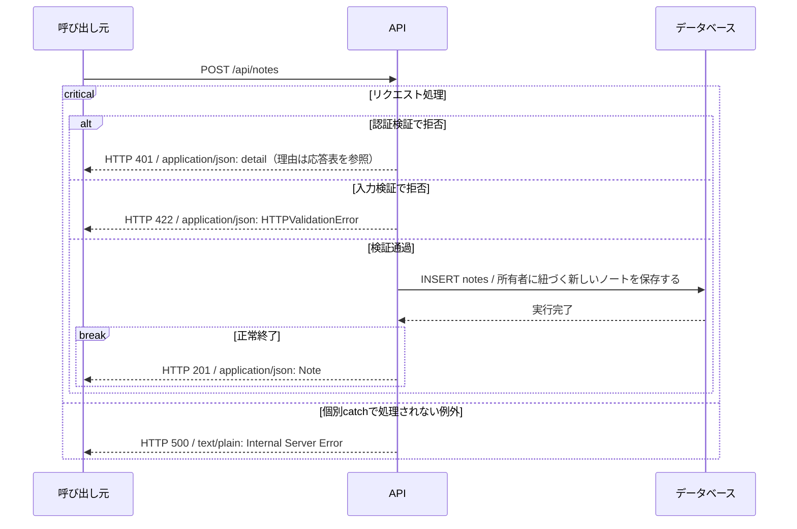

# create_note シーケンス

<!-- Generated by tools/design.py. Do not edit. -->

`POST /api/notes` / operationId: `create_note`

ハンドラ: [backend/src/app/apis/notes/create_note/router.py:11](https://github.com/tsuji-tomonori/CornellNoteWebv2/blob/dev/backend/src/app/apis/notes/create_note/router.py#L11)

処理: [backend/src/app/apis/notes/create_note/functions.py:11](https://github.com/tsuji-tomonori/CornellNoteWebv2/blob/dev/backend/src/app/apis/notes/create_note/functions.py#L11)

## 入力

| 位置 | 名前 | 型 | 必須 |
| --- | --- | --- | --- |
| header | Authorization | Bearer JWT | True |
| body | application/json | NoteInput | True |

## 呼出し・分岐・応答

生成ラッパー・with・変換用関数の表示を省き、ifとtry/catch、DB操作、HTTP応答を表示する。breakはその経路の終了。入力と認証に複数の不備がある場合の検証順序は省略し、確定した応答別に分岐する。

## DBアクセス

| テーブル | 操作 | 処理 | 絞込み条件 | バインド引数 |
| --- | --- | --- | --- | --- |
| notes | INSERT | 所有者に紐づく新しいノートを保存する | なし | content, cue, group_name, id, owner_id, summary, tasks, title, updated_at |

接続は`DSQL_HOST`（AWSのAurora DSQL）または`DATABASE_URL`（ローカルPostgreSQL）。接続処理: [backend/src/app/db.py](https://github.com/tsuji-tomonori/CornellNoteWebv2/blob/dev/backend/src/app/db.py) / ローカル構成: [compose.yaml](https://github.com/tsuji-tomonori/CornellNoteWebv2/blob/dev/compose.yaml)

## このAPIのHTTP応答

| HTTP | 処理区分 | 条件 | 応答内容 |
| --- | --- | --- | --- |
| 201 | API | 正常終了 | application/json: Note |
| 401 | API / 認証 | ログインが必要です | application/json: {detail: "ログインが必要です"} |
| 401 | API / 認証 | 認証情報が無効です | application/json: {detail: "認証情報が無効です"} |
| 401 | API / 認証 | 認証情報が無効または期限切れです | application/json: {detail: "認証情報が無効または期限切れです"} |
| 422 | FastAPI入力検証 | パス・query・bodyの型/制約違反、必須項目不足、不正なJSON | application/json: HTTPValidationError（detail配列） |
| 500 | FastAPI / Starlette共通処理 | 未処理例外（DB接続・実行・結果変換など）。個別catchでHTTP応答に変換した例外はそのコードを返す | text/plain: Internal Server Error |

## ハンドラ到達前の共通応答

| HTTP | 処理区分 | 条件 | 応答内容 |
| --- | --- | --- | --- |
| 404 | ルーティング | URLが登録済みパスに一致しない（このAPIのハンドラには到達しない） | application/json: {detail: "Not Found"} |
| 405 | ルーティング | URLは存在するがHTTPメソッドが許可されていない | application/json: {detail: "Method Not Allowed"} / Allowヘッダー |
| 307 | ルーティング | 末尾スラッシュの補正で既存パスへリダイレクトする | 本文なし / Locationヘッダー |

共通404はURL不一致であり、一覧が空であることを意味しない。500は未処理例外の標準応答であり、DB失敗が必ず500とは限らない（更新競合の409などは個別catchを優先する）。

根拠: 実装AST・OpenAPI・現在の標準例外ハンドラ。共通応答の実測テスト: [backend/tests/test_response_contract.py](https://github.com/tsuji-tomonori/CornellNoteWebv2/blob/dev/backend/tests/test_response_contract.py)。CloudFront/API Gateway自身のエラーはこのFastAPI図の対象外。
