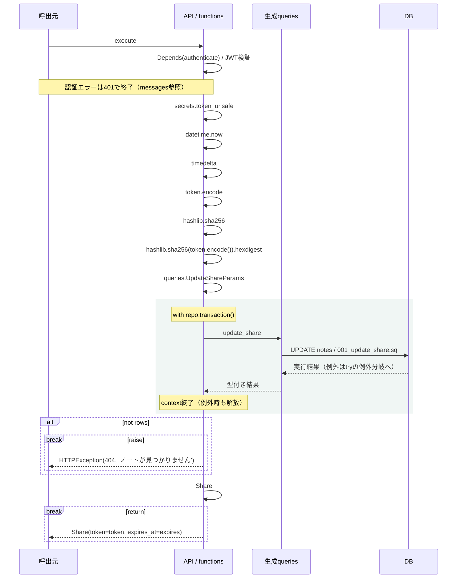

# create_share シーケンス

<!-- Generated by tools/design.py. Do not edit. -->

`POST /api/notes/{note_id}/share` / operationId: `create_share`

ハンドラ: [backend/src/app/apis/notes/create_share/router.py:13](https://github.com/tsuji-tomonori/CornellNoteWebv2/blob/dev/backend/src/app/apis/notes/create_share/router.py#L13)

処理: [backend/src/app/apis/notes/create_share/functions.py:13](https://github.com/tsuji-tomonori/CornellNoteWebv2/blob/dev/backend/src/app/apis/notes/create_share/functions.py#L13)

routerから呼ぶ業務関数の分岐・transaction・例外をAST順に表示する。self呼出の外部ライブラリ内部、式中の短絡・内包表記内部は展開しない。breakはその経路の終了を表す。

