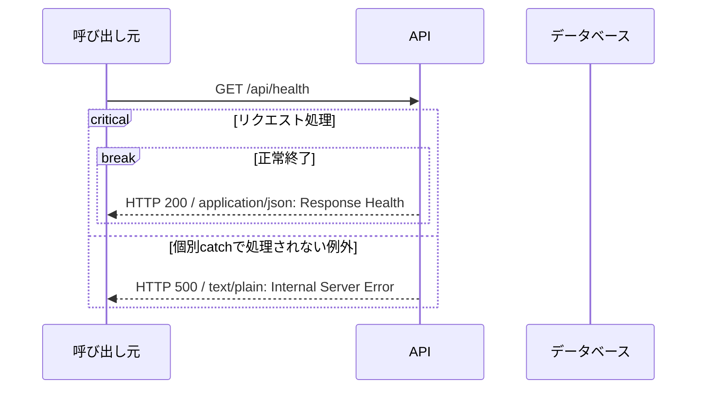

# health シーケンス

<!-- Generated by tools/design.py. Do not edit. -->

`GET /api/health` / operationId: `health`

ハンドラ: [backend/src/app/apis/system/router.py:9](https://github.com/tsuji-tomonori/CornellNoteWebv2/blob/dev/backend/src/app/apis/system/router.py#L9)

処理: [backend/src/app/apis/system/router.py:9](https://github.com/tsuji-tomonori/CornellNoteWebv2/blob/dev/backend/src/app/apis/system/router.py#L9)

## 入力

該当なし。

## 呼出し・分岐・応答

生成ラッパー・with・変換用関数の表示を省き、ifとtry/catch、DB操作、HTTP応答を表示する。breakはその経路の終了。入力と認証に複数の不備がある場合の検証順序は省略し、確定した応答別に分岐する。

## DBアクセス

該当なし。

このAPIはDBへアクセスしない。

## このAPIのHTTP応答

| HTTP | 処理区分 | 条件 | 応答内容 |
| --- | --- | --- | --- |
| 200 | API | 正常終了 | application/json: Response Health |
| 500 | FastAPI / Starlette共通処理 | 未処理例外（DB接続・実行・結果変換など）。個別catchでHTTP応答に変換した例外はそのコードを返す | text/plain: Internal Server Error |

## ハンドラ到達前の共通応答

| HTTP | 処理区分 | 条件 | 応答内容 |
| --- | --- | --- | --- |
| 404 | ルーティング | URLが登録済みパスに一致しない（このAPIのハンドラには到達しない） | application/json: {detail: "Not Found"} |
| 405 | ルーティング | URLは存在するがHTTPメソッドが許可されていない | application/json: {detail: "Method Not Allowed"} / Allowヘッダー |
| 307 | ルーティング | 末尾スラッシュの補正で既存パスへリダイレクトする | 本文なし / Locationヘッダー |

共通404はURL不一致であり、一覧が空であることを意味しない。500は未処理例外の標準応答であり、DB失敗が必ず500とは限らない（更新競合の409などは個別catchを優先する）。

根拠: 実装AST・OpenAPI・現在の標準例外ハンドラ。共通応答の実測テスト: [backend/tests/test_response_contract.py](https://github.com/tsuji-tomonori/CornellNoteWebv2/blob/dev/backend/tests/test_response_contract.py)。CloudFront/API Gateway自身のエラーはこのFastAPI図の対象外。
