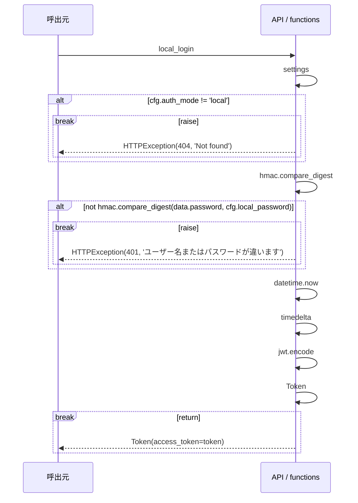

# local_login シーケンス

<!-- Generated by tools/design.py. Do not edit. -->

`POST /api/auth/local` / operationId: `local_login`

ハンドラ: [backend/src/app/apis/system/router.py:14](https://github.com/tsuji-tomonori/CornellNoteWebv2/blob/dev/backend/src/app/apis/system/router.py#L14)

処理: [backend/src/app/auth.py:65](https://github.com/tsuji-tomonori/CornellNoteWebv2/blob/dev/backend/src/app/auth.py#L65)

routerから呼ぶ業務関数の分岐・transaction・例外をAST順に表示する。self呼出の外部ライブラリ内部、式中の短絡・内包表記内部は展開しない。breakはその経路の終了を表す。

