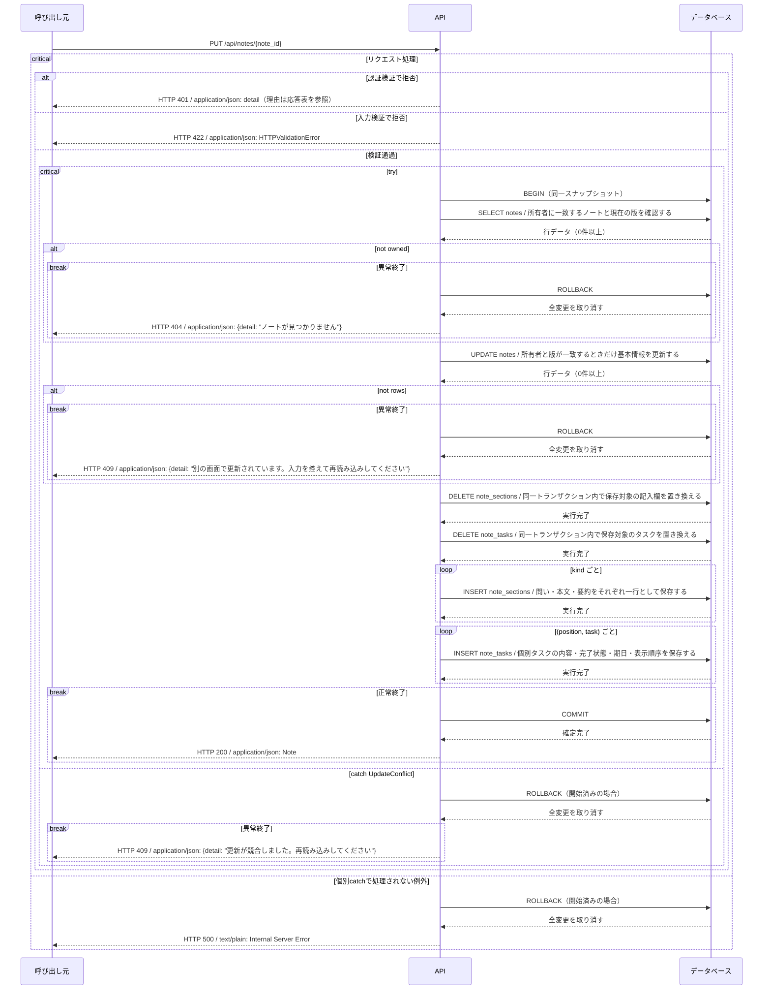

# update_note シーケンス

<!-- Generated by tools/design.py. Do not edit. -->

`PUT /api/notes/{note_id}` / operationId: `update_note`

ハンドラ: [backend/src/app/apis/notes/update_note/router.py:15](https://github.com/tsuji-tomonori/CornellNoteWebv2/blob/dev/backend/src/app/apis/notes/update_note/router.py#L15)

処理: [backend/src/app/apis/notes/update_note/functions.py:15](https://github.com/tsuji-tomonori/CornellNoteWebv2/blob/dev/backend/src/app/apis/notes/update_note/functions.py#L15)

## 入力

| 位置 | 名前 | 型 | 必須 |
| --- | --- | --- | --- |
| path | note_id | Note Id | True |
| header | Authorization | Bearer JWT | True |
| body | application/json | NoteUpdate | True |

## 呼出し・分岐・応答

ルーターを起点に関数呼出しを展開し、ifとtry/catch、DB操作、BEGIN・COMMIT・ROLLBACK、HTTP応答を表示する。関数層ではトランザクションを開始しない。成功応答はCOMMIT完了後に返す。breakはその経路の終了。入力と認証に複数の不備がある場合の検証順序は省略し、確定した応答別に分岐する。

## DBアクセス

| テーブル | 操作 | 処理 | 絞込み条件 | バインド引数 |
| --- | --- | --- | --- | --- |
| notes | SELECT | 所有者に一致するノートと現在の版を確認する | WHERE id = %(id)s AND owner_id = %(owner_id)s | id, owner_id |
| notes | UPDATE | 所有者と版が一致するときだけ基本情報を更新する | WHERE id = %(id)s AND owner_id = %(owner_id)s AND version = %(version)s | group_name, id, owner_id, title, updated_at, version |
| note_sections | DELETE | 同一トランザクション内で保存対象の記入欄を置き換える | WHERE note_id = %(note_id)s | note_id |
| note_tasks | DELETE | 同一トランザクション内で保存対象のタスクを置き換える | WHERE note_id = %(note_id)s | note_id |
| note_sections | INSERT | 問い・本文・要約をそれぞれ一行として保存する | なし | body, kind, note_id, updated_at |
| note_tasks | INSERT | 個別タスクの内容・完了状態・期日・表示順序を保存する | なし | done, due, id, note_id, position, text |

接続は`DSQL_HOST`（AWSのAurora DSQL）または`DATABASE_URL`（ローカルPostgreSQL）。接続処理: [backend/src/app/db.py](https://github.com/tsuji-tomonori/CornellNoteWebv2/blob/dev/backend/src/app/db.py) / ローカル構成: [compose.yaml](https://github.com/tsuji-tomonori/CornellNoteWebv2/blob/dev/compose.yaml)

## このAPIのHTTP応答

| HTTP | 処理区分 | 条件 | 応答内容 |
| --- | --- | --- | --- |
| 200 | API | 正常終了 | application/json: Note |
| 401 | API / 認証 | ログインが必要です | application/json: {detail: "ログインが必要です"} |
| 401 | API / 認証 | 認証情報が無効です | application/json: {detail: "認証情報が無効です"} |
| 401 | API / 認証 | 認証情報が無効または期限切れです | application/json: {detail: "認証情報が無効または期限切れです"} |
| 404 | API / 認証 | ノートが見つかりません | application/json: {detail: "ノートが見つかりません"} |
| 409 | API / 認証 | 別の画面で更新されています。入力を控えて再読み込みしてください | application/json: {detail: "別の画面で更新されています。入力を控えて再読み込みしてください"} |
| 409 | API / 認証 | 更新が競合しました。再読み込みしてください | application/json: {detail: "更新が競合しました。再読み込みしてください"} |
| 422 | FastAPI入力検証 | パス・query・bodyの型/制約違反、必須項目不足、不正なJSON | application/json: HTTPValidationError（detail配列） |
| 500 | FastAPI / Starlette共通処理 | 未処理例外（DB接続・実行・結果変換など）。個別catchでHTTP応答に変換した例外はそのコードを返す | text/plain: Internal Server Error |

## ハンドラ到達前の共通応答

| HTTP | 処理区分 | 条件 | 応答内容 |
| --- | --- | --- | --- |
| 404 | ルーティング | URLが登録済みパスに一致しない（このAPIのハンドラには到達しない） | application/json: {detail: "Not Found"} |
| 405 | ルーティング | URLは存在するがHTTPメソッドが許可されていない | application/json: {detail: "Method Not Allowed"} / Allowヘッダー |
| 307 | ルーティング | 末尾スラッシュの補正で既存パスへリダイレクトする | 本文なし / Locationヘッダー |

共通404はURL不一致であり、一覧が空であることを意味しない。500は未処理例外の標準応答であり、DB失敗が必ず500とは限らない（更新競合の409などは個別catchを優先する）。

根拠: 実装AST・OpenAPI・現在の標準例外ハンドラ。共通応答の実測テスト: [backend/tests/test_response_contract.py](https://github.com/tsuji-tomonori/CornellNoteWebv2/blob/dev/backend/tests/test_response_contract.py)。CloudFront/API Gateway自身のエラーはこのFastAPI図の対象外。
