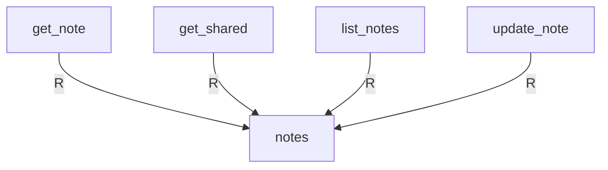
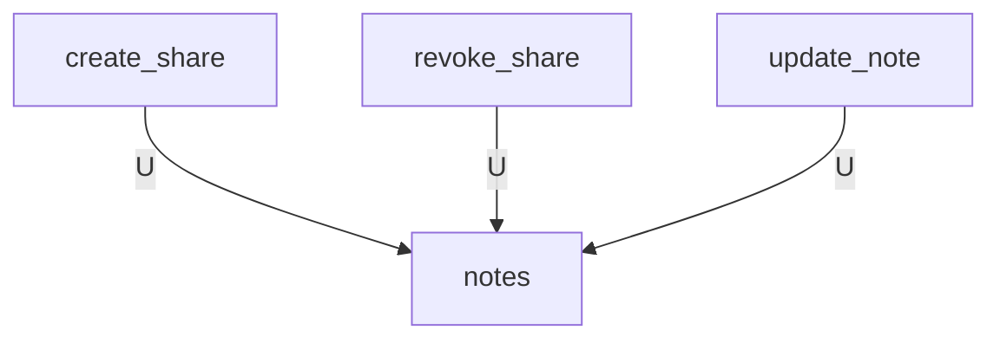
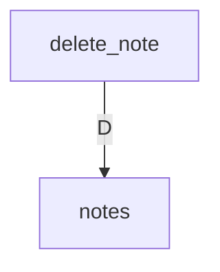

# テーブル × API CRUD図

<!-- Generated by tools/design.py. Do not edit. -->

C=作成 / R=参照 / U=更新 / D=削除。SQL文種別に基づく対応で、UPDATE・DELETEのWHERE判定は別のRとして加算しない。schema_migrationsはAPIから直接操作せずmigrationで管理する。

| API | notes | schema_migrations |
| --- | --- | --- |
| create_note | C | — |
| create_share | U | — |
| delete_note | D | — |
| get_note | R | — |
| get_shared | R | — |
| list_notes | R | — |
| revoke_share | U | — |
| update_note | R / U | — |

## notes INSERT

## notes SELECT

## notes UPDATE

## notes DELETE

## SQL・カラム詳細

| テーブル | API | SQL操作 | 参照列 | 書込列 | 正本 |
| --- | --- | --- | --- | --- | --- |
| notes | create_note | INSERT |  | id, owner_id, title, group_name, cue, content, summary, tasks, version, updated_at | [backend/src/app/apis/notes/create_note/sql/001_insert_note.sql](https://github.com/tsuji-tomonori/CornellNoteWebv2/blob/dev/backend/src/app/apis/notes/create_note/sql/001_insert_note.sql) |
| notes | create_share | UPDATE | id, owner_id, share_expires, share_hash | share_hash, share_expires | [backend/src/app/apis/notes/create_share/sql/001_update_share.sql](https://github.com/tsuji-tomonori/CornellNoteWebv2/blob/dev/backend/src/app/apis/notes/create_share/sql/001_update_share.sql) |
| notes | delete_note | DELETE | id, owner_id |  | [backend/src/app/apis/notes/delete_note/sql/001_delete_note.sql](https://github.com/tsuji-tomonori/CornellNoteWebv2/blob/dev/backend/src/app/apis/notes/delete_note/sql/001_delete_note.sql) |
| notes | get_note | SELECT | content, cue, group_name, id, owner_id, summary, tasks, title, updated_at, version |  | [backend/src/app/apis/notes/get_note/sql/001_select_note.sql](https://github.com/tsuji-tomonori/CornellNoteWebv2/blob/dev/backend/src/app/apis/notes/get_note/sql/001_select_note.sql) |
| notes | get_shared | SELECT | content, cue, group_name, id, share_expires, share_hash, summary, tasks, title, updated_at, version |  | [backend/src/app/apis/notes/get_shared/sql/001_select_shared_note.sql](https://github.com/tsuji-tomonori/CornellNoteWebv2/blob/dev/backend/src/app/apis/notes/get_shared/sql/001_select_shared_note.sql) |
| notes | list_notes | SELECT | content, cue, group_name, id, owner_id, summary, tasks, title, updated_at, version |  | [backend/src/app/apis/notes/list_notes/sql/001_select_notes.sql](https://github.com/tsuji-tomonori/CornellNoteWebv2/blob/dev/backend/src/app/apis/notes/list_notes/sql/001_select_notes.sql) |
| notes | revoke_share | UPDATE | id, owner_id, share_expires, share_hash | share_hash, share_expires | [backend/src/app/apis/notes/revoke_share/sql/001_revoke_share.sql](https://github.com/tsuji-tomonori/CornellNoteWebv2/blob/dev/backend/src/app/apis/notes/revoke_share/sql/001_revoke_share.sql) |
| notes | update_note | UPDATE | content, cue, group_name, id, owner_id, summary, tasks, title, updated_at, version | title, group_name, cue, content, summary, tasks, version, updated_at | [backend/src/app/apis/notes/update_note/sql/001_update_note.sql](https://github.com/tsuji-tomonori/CornellNoteWebv2/blob/dev/backend/src/app/apis/notes/update_note/sql/001_update_note.sql) |
| notes | update_note | SELECT | id, owner_id |  | [backend/src/app/apis/notes/update_note/sql/002_select_owned_note.sql](https://github.com/tsuji-tomonori/CornellNoteWebv2/blob/dev/backend/src/app/apis/notes/update_note/sql/002_select_owned_note.sql) |
