# テーブル × API CRUD図

<!-- Generated by tools/design.py. Do not edit. -->

C=作成 / R=参照 / U=更新 / D=削除。SQL文種別に基づく対応で、UPDATE・DELETEのWHERE判定は別のRとして加算しない。JOIN先の参照もRとして含める。schema_migrationsはAPIから直接操作せずmigrationで管理する。

| API | note_sections | note_shares | note_tasks | notes | schema_migrations | users |
| --- | --- | --- | --- | --- | --- | --- |
| create_note | C | — | C | C | — | C |
| create_share | — | C / D | — | R | — | — |
| delete_note | D | D | D | D / R | — | — |
| get_note | R | — | R | R | — | — |
| get_shared | R | R | R | R | — | — |
| list_notes | R | — | R | R | — | — |
| list_tasks | — | — | R | R | — | — |
| revoke_share | — | D | — | R | — | — |
| update_note | C / D | — | C / D | R / U | — | — |

## note_sections INSERT

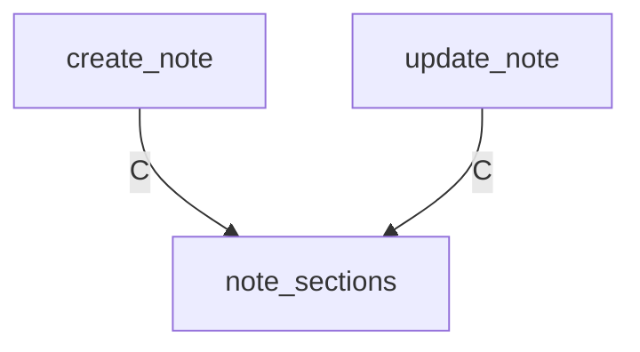

## note_sections SELECT

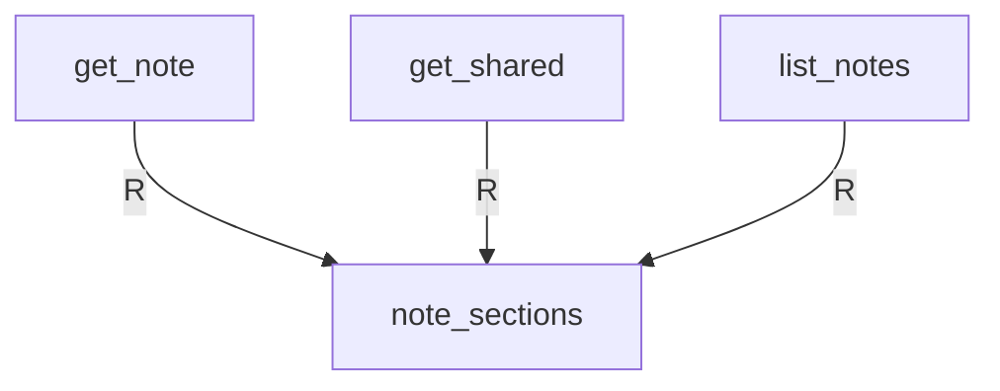

## note_sections DELETE

## note_shares INSERT

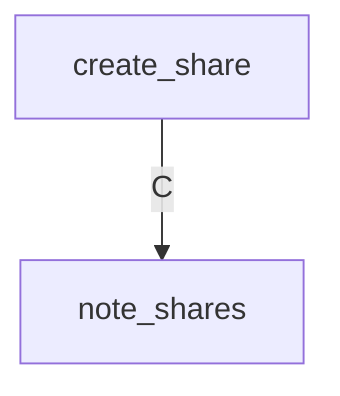

## note_shares SELECT

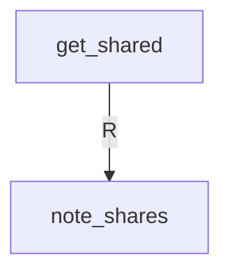

## note_shares DELETE

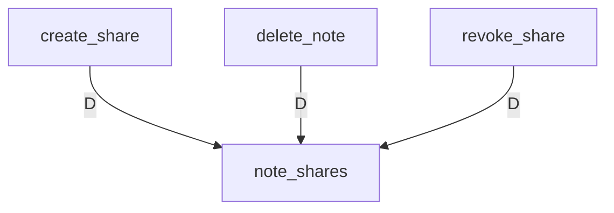

## note_tasks INSERT

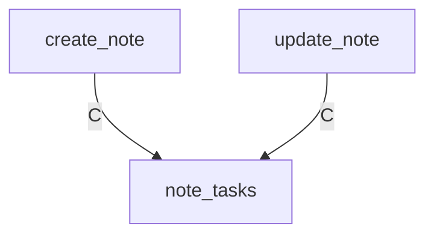

## note_tasks SELECT

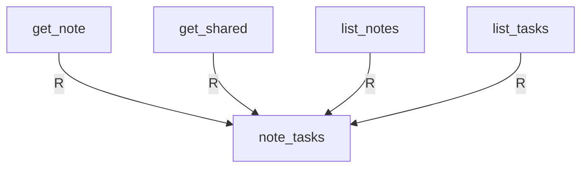

## note_tasks DELETE

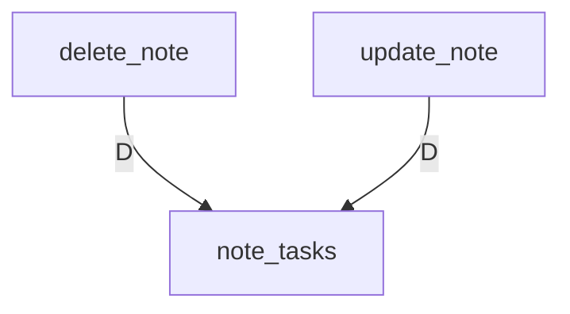

## notes INSERT

## notes SELECT

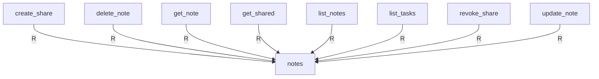

## notes UPDATE

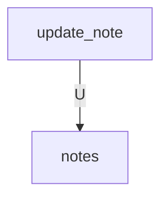

## notes DELETE

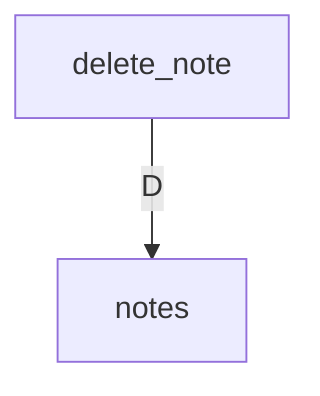

## users INSERT

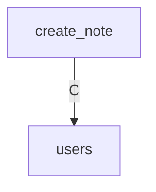

## SQL・カラム詳細

| テーブル | API | SQL操作 | 参照列 | 書込列 | 正本 |
| --- | --- | --- | --- | --- | --- |
| users | create_note | INSERT |  | id, created_at | [backend/src/app/apis/notes/create_note/sql/001_insert_user.sql](https://github.com/tsuji-tomonori/CornellNoteWebv2/blob/dev/backend/src/app/apis/notes/create_note/sql/001_insert_user.sql) |
| notes | create_note | INSERT | group_name, id, title, updated_at, version | id, owner_id, title, group_name, version, updated_at | [backend/src/app/apis/notes/create_note/sql/002_insert_note.sql](https://github.com/tsuji-tomonori/CornellNoteWebv2/blob/dev/backend/src/app/apis/notes/create_note/sql/002_insert_note.sql) |
| note_sections | create_note | INSERT |  | note_id, kind, body, updated_at | [backend/src/app/apis/notes/create_note/sql/003_insert_section.sql](https://github.com/tsuji-tomonori/CornellNoteWebv2/blob/dev/backend/src/app/apis/notes/create_note/sql/003_insert_section.sql) |
| note_tasks | create_note | INSERT |  | note_id, id, text, done, due, position | [backend/src/app/apis/notes/create_note/sql/004_insert_task.sql](https://github.com/tsuji-tomonori/CornellNoteWebv2/blob/dev/backend/src/app/apis/notes/create_note/sql/004_insert_task.sql) |
| notes | create_share | SELECT | id, owner_id |  | [backend/src/app/apis/notes/create_share/sql/001_select_owned_note.sql](https://github.com/tsuji-tomonori/CornellNoteWebv2/blob/dev/backend/src/app/apis/notes/create_share/sql/001_select_owned_note.sql) |
| note_shares | create_share | DELETE | note_id |  | [backend/src/app/apis/notes/create_share/sql/002_delete_share.sql](https://github.com/tsuji-tomonori/CornellNoteWebv2/blob/dev/backend/src/app/apis/notes/create_share/sql/002_delete_share.sql) |
| note_shares | create_share | INSERT |  | note_id, token_hash, expires_at, created_by | [backend/src/app/apis/notes/create_share/sql/003_insert_share.sql](https://github.com/tsuji-tomonori/CornellNoteWebv2/blob/dev/backend/src/app/apis/notes/create_share/sql/003_insert_share.sql) |
| notes | delete_note | SELECT | id, owner_id |  | [backend/src/app/apis/notes/delete_note/sql/001_select_owned_note.sql](https://github.com/tsuji-tomonori/CornellNoteWebv2/blob/dev/backend/src/app/apis/notes/delete_note/sql/001_select_owned_note.sql) |
| note_tasks | delete_note | DELETE | note_id |  | [backend/src/app/apis/notes/delete_note/sql/002_delete_tasks.sql](https://github.com/tsuji-tomonori/CornellNoteWebv2/blob/dev/backend/src/app/apis/notes/delete_note/sql/002_delete_tasks.sql) |
| note_sections | delete_note | DELETE | note_id |  | [backend/src/app/apis/notes/delete_note/sql/003_delete_sections.sql](https://github.com/tsuji-tomonori/CornellNoteWebv2/blob/dev/backend/src/app/apis/notes/delete_note/sql/003_delete_sections.sql) |
| note_shares | delete_note | DELETE | note_id |  | [backend/src/app/apis/notes/delete_note/sql/004_delete_share.sql](https://github.com/tsuji-tomonori/CornellNoteWebv2/blob/dev/backend/src/app/apis/notes/delete_note/sql/004_delete_share.sql) |
| notes | delete_note | DELETE | id, owner_id |  | [backend/src/app/apis/notes/delete_note/sql/005_delete_note.sql](https://github.com/tsuji-tomonori/CornellNoteWebv2/blob/dev/backend/src/app/apis/notes/delete_note/sql/005_delete_note.sql) |
| notes | get_note | SELECT | group_name, id, owner_id, title, updated_at, version |  | [backend/src/app/apis/notes/get_note/sql/001_select_note.sql](https://github.com/tsuji-tomonori/CornellNoteWebv2/blob/dev/backend/src/app/apis/notes/get_note/sql/001_select_note.sql) |
| note_sections | get_note | SELECT | body, id, kind, note_id, owner_id |  | [backend/src/app/apis/notes/get_note/sql/002_select_sections.sql](https://github.com/tsuji-tomonori/CornellNoteWebv2/blob/dev/backend/src/app/apis/notes/get_note/sql/002_select_sections.sql) |
| note_tasks | get_note | SELECT | done, due, id, note_id, owner_id, position, text |  | [backend/src/app/apis/notes/get_note/sql/003_select_tasks.sql](https://github.com/tsuji-tomonori/CornellNoteWebv2/blob/dev/backend/src/app/apis/notes/get_note/sql/003_select_tasks.sql) |
| notes | get_shared | SELECT | expires_at, group_name, id, note_id, title, token_hash, updated_at, version |  | [backend/src/app/apis/notes/get_shared/sql/001_select_note.sql](https://github.com/tsuji-tomonori/CornellNoteWebv2/blob/dev/backend/src/app/apis/notes/get_shared/sql/001_select_note.sql) |
| note_sections | get_shared | SELECT | body, expires_at, id, kind, note_id, token_hash |  | [backend/src/app/apis/notes/get_shared/sql/002_select_sections.sql](https://github.com/tsuji-tomonori/CornellNoteWebv2/blob/dev/backend/src/app/apis/notes/get_shared/sql/002_select_sections.sql) |
| note_tasks | get_shared | SELECT | done, due, expires_at, id, note_id, position, text, token_hash |  | [backend/src/app/apis/notes/get_shared/sql/003_select_tasks.sql](https://github.com/tsuji-tomonori/CornellNoteWebv2/blob/dev/backend/src/app/apis/notes/get_shared/sql/003_select_tasks.sql) |
| notes | list_notes | SELECT | group_name, id, owner_id, title, updated_at, version |  | [backend/src/app/apis/notes/list_notes/sql/001_select_notes.sql](https://github.com/tsuji-tomonori/CornellNoteWebv2/blob/dev/backend/src/app/apis/notes/list_notes/sql/001_select_notes.sql) |
| note_sections | list_notes | SELECT | body, id, kind, note_id, owner_id |  | [backend/src/app/apis/notes/list_notes/sql/002_select_sections.sql](https://github.com/tsuji-tomonori/CornellNoteWebv2/blob/dev/backend/src/app/apis/notes/list_notes/sql/002_select_sections.sql) |
| note_tasks | list_notes | SELECT | done, due, id, note_id, owner_id, position, text |  | [backend/src/app/apis/notes/list_notes/sql/003_select_tasks.sql](https://github.com/tsuji-tomonori/CornellNoteWebv2/blob/dev/backend/src/app/apis/notes/list_notes/sql/003_select_tasks.sql) |
| note_tasks | list_tasks | SELECT | done, due, group_name, id, note_id, owner_id, position, text, title |  | [backend/src/app/apis/notes/list_tasks/sql/001_select_tasks.sql](https://github.com/tsuji-tomonori/CornellNoteWebv2/blob/dev/backend/src/app/apis/notes/list_tasks/sql/001_select_tasks.sql) |
| notes | revoke_share | SELECT | id, owner_id |  | [backend/src/app/apis/notes/revoke_share/sql/001_select_owned_note.sql](https://github.com/tsuji-tomonori/CornellNoteWebv2/blob/dev/backend/src/app/apis/notes/revoke_share/sql/001_select_owned_note.sql) |
| note_shares | revoke_share | DELETE | note_id |  | [backend/src/app/apis/notes/revoke_share/sql/002_delete_share.sql](https://github.com/tsuji-tomonori/CornellNoteWebv2/blob/dev/backend/src/app/apis/notes/revoke_share/sql/002_delete_share.sql) |
| notes | update_note | SELECT | group_name, id, owner_id, title, updated_at, version |  | [backend/src/app/apis/notes/update_note/sql/001_select_owned_note.sql](https://github.com/tsuji-tomonori/CornellNoteWebv2/blob/dev/backend/src/app/apis/notes/update_note/sql/001_select_owned_note.sql) |
| notes | update_note | UPDATE | group_name, id, owner_id, title, updated_at, version | title, group_name, version, updated_at | [backend/src/app/apis/notes/update_note/sql/002_update_note.sql](https://github.com/tsuji-tomonori/CornellNoteWebv2/blob/dev/backend/src/app/apis/notes/update_note/sql/002_update_note.sql) |
| note_sections | update_note | DELETE | note_id |  | [backend/src/app/apis/notes/update_note/sql/003_delete_sections.sql](https://github.com/tsuji-tomonori/CornellNoteWebv2/blob/dev/backend/src/app/apis/notes/update_note/sql/003_delete_sections.sql) |
| note_tasks | update_note | DELETE | note_id |  | [backend/src/app/apis/notes/update_note/sql/004_delete_tasks.sql](https://github.com/tsuji-tomonori/CornellNoteWebv2/blob/dev/backend/src/app/apis/notes/update_note/sql/004_delete_tasks.sql) |
| note_sections | update_note | INSERT |  | note_id, kind, body, updated_at | [backend/src/app/apis/notes/update_note/sql/005_insert_section.sql](https://github.com/tsuji-tomonori/CornellNoteWebv2/blob/dev/backend/src/app/apis/notes/update_note/sql/005_insert_section.sql) |
| note_tasks | update_note | INSERT |  | note_id, id, text, done, due, position | [backend/src/app/apis/notes/update_note/sql/006_insert_task.sql](https://github.com/tsuji-tomonori/CornellNoteWebv2/blob/dev/backend/src/app/apis/notes/update_note/sql/006_insert_task.sql) |
