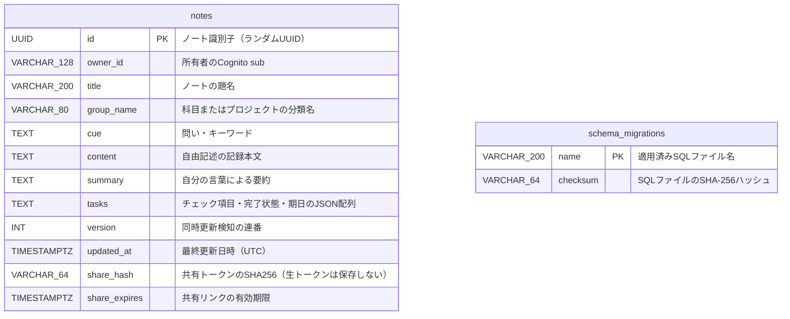

# DB全体ER図

<!-- Generated by tools/design.py. Do not edit. -->

DDLに定義された物理テーブルを表示する。現在、外部キーは定義されていないため関連線はない。owner_idは外部認証主体でありDB外部キーではない。

```mermaid
erDiagram
    notes {
        UUID id PK "ノート識別子（ランダムUUID）"
        VARCHAR_128 owner_id "所有者のCognito sub"
        VARCHAR_200 title "ノートの題名"
        VARCHAR_80 group_name "科目またはプロジェクトの分類名"
        TEXT cue "問い・キーワード"
        TEXT content "自由記述の記録本文"
        TEXT summary "自分の言葉による要約"
        TEXT tasks "チェック項目・完了状態・期日のJSON配列"
        INT version "同時更新検知の連番"
        TIMESTAMPTZ updated_at "最終更新日時（UTC）"
        VARCHAR_64 share_hash "共有トークンのSHA256（生トークンは保存しない）"
        TIMESTAMPTZ share_expires "共有リンクの有効期限"
    }
    schema_migrations {
        VARCHAR_200 name PK "適用済みSQLファイル名"
        VARCHAR_64 checksum "SQLファイルのSHA-256ハッシュ"
    }
```
