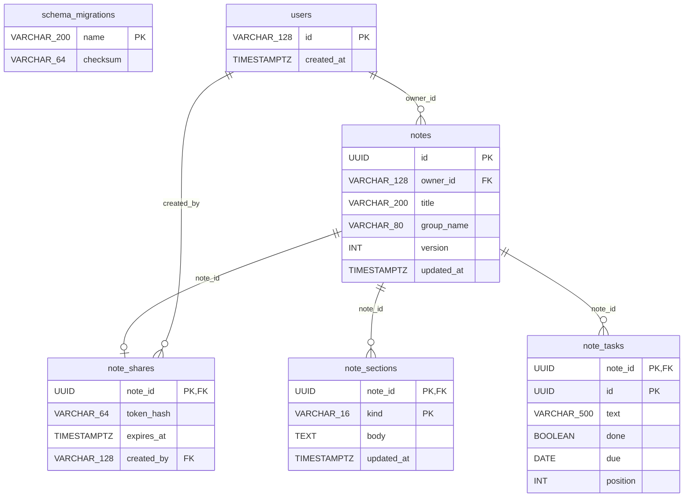

# DB全体ER図

<!-- Generated by tools/design.py. Do not edit. -->

DDLとALTER適用後の物理テーブル・外部キーを表示する。usersはCognito subを持ち、notes.owner_idが所有者を参照する。note_sharesは期限付き匿名閲覧の許可、note_sectionsは種類別の記入欄、note_tasksは個別タスクを表す。

