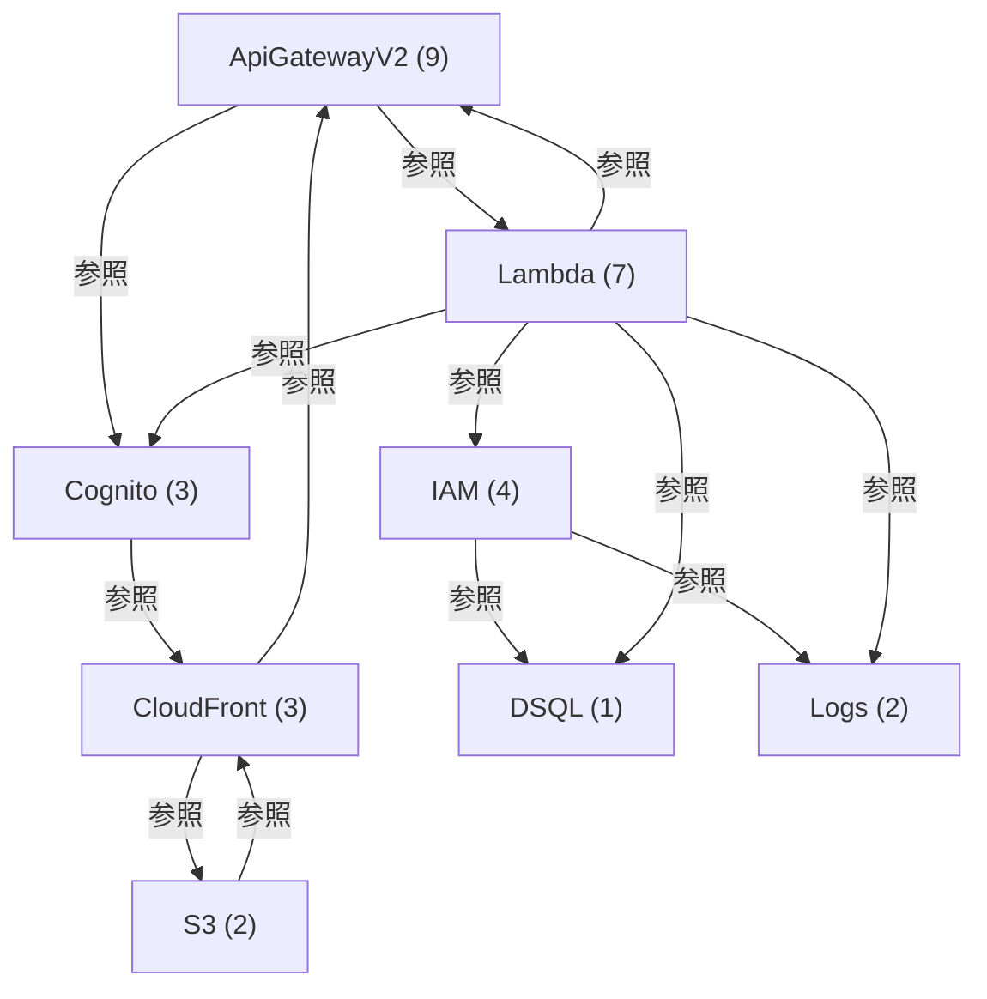

# CDK構成・参照依存図

<!-- Generated by tools/design.py. Do not edit. -->

テンプレート中のRef・GetAtt・DependsOnから生成した依存関係。矢印は設定の参照方向であり、通信方向ではない。

## リソース間の参照

| 参照元 | 参照先 |
| --- | --- |
| [ApiFunctionCE271BD4](types/aws-lambda-function.gen.md#apifunctionce271bd4) | [ApiLogs3D05D88B](types/aws-logs-loggroup.gen.md#apilogs3d05d88b) |
| [ApiFunctionCE271BD4](types/aws-lambda-function.gen.md#apifunctionce271bd4) | [ApiRole1873F438](types/aws-iam-role.gen.md#apirole1873f438) |
| [ApiFunctionCE271BD4](types/aws-lambda-function.gen.md#apifunctionce271bd4) | [ApiRoleDefaultPolicyCFEBAD31](types/aws-iam-policy.gen.md#apiroledefaultpolicycfebad31) |
| [ApiFunctionCE271BD4](types/aws-lambda-function.gen.md#apifunctionce271bd4) | [Database](types/aws-dsql-cluster.gen.md#database) |
| [ApiFunctionCE271BD4](types/aws-lambda-function.gen.md#apifunctionce271bd4) | [Users0A0EEA89](types/aws-cognito-userpool.gen.md#users0a0eea89) |
| [ApiFunctionCE271BD4](types/aws-lambda-function.gen.md#apifunctionce271bd4) | [UsersBrowser427D6876](types/aws-cognito-userpoolclient.gen.md#usersbrowser427d6876) |
| [ApiRoleDefaultPolicyCFEBAD31](types/aws-iam-policy.gen.md#apiroledefaultpolicycfebad31) | [ApiLogs3D05D88B](types/aws-logs-loggroup.gen.md#apilogs3d05d88b) |
| [ApiRoleDefaultPolicyCFEBAD31](types/aws-iam-policy.gen.md#apiroledefaultpolicycfebad31) | [ApiRole1873F438](types/aws-iam-role.gen.md#apirole1873f438) |
| [ApiRoleDefaultPolicyCFEBAD31](types/aws-iam-policy.gen.md#apiroledefaultpolicycfebad31) | [Database](types/aws-dsql-cluster.gen.md#database) |
| [FrontendPolicy442AF6CA](types/aws-s3-bucketpolicy.gen.md#frontendpolicy442af6ca) | [Frontend23D93C55](types/aws-s3-bucket.gen.md#frontend23d93c55) |
| [FrontendPolicy442AF6CA](types/aws-s3-bucketpolicy.gen.md#frontendpolicy442af6ca) | [Web3C8945DB](types/aws-cloudfront-distribution.gen.md#web3c8945db) |
| [HttpApiANYapinotes49E219FC](types/aws-apigatewayv2-route.gen.md#httpapianyapinotes49e219fc) | [HttpApiANYapinotesFastApiIntegration445527F5](types/aws-apigatewayv2-integration.gen.md#httpapianyapinotesfastapiintegration445527f5) |
| [HttpApiANYapinotes49E219FC](types/aws-apigatewayv2-route.gen.md#httpapianyapinotes49e219fc) | [HttpApiCognitoJwt4B02D8E4](types/aws-apigatewayv2-authorizer.gen.md#httpapicognitojwt4b02d8e4) |
| [HttpApiANYapinotes49E219FC](types/aws-apigatewayv2-route.gen.md#httpapianyapinotes49e219fc) | [HttpApiF5A9A8A7](types/aws-apigatewayv2-api.gen.md#httpapif5a9a8a7) |
| [HttpApiANYapinotesFastApiIntegration445527F5](types/aws-apigatewayv2-integration.gen.md#httpapianyapinotesfastapiintegration445527f5) | [ApiFunctionCE271BD4](types/aws-lambda-function.gen.md#apifunctionce271bd4) |
| [HttpApiANYapinotesFastApiIntegration445527F5](types/aws-apigatewayv2-integration.gen.md#httpapianyapinotesfastapiintegration445527f5) | [HttpApiF5A9A8A7](types/aws-apigatewayv2-api.gen.md#httpapif5a9a8a7) |
| [HttpApiANYapinotesFastApiIntegrationPermission80191C22](types/aws-lambda-permission.gen.md#httpapianyapinotesfastapiintegrationpermission80191c22) | [ApiFunctionCE271BD4](types/aws-lambda-function.gen.md#apifunctionce271bd4) |
| [HttpApiANYapinotesFastApiIntegrationPermission80191C22](types/aws-lambda-permission.gen.md#httpapianyapinotesfastapiintegrationpermission80191c22) | [HttpApiF5A9A8A7](types/aws-apigatewayv2-api.gen.md#httpapif5a9a8a7) |
| [HttpApiANYapinotesproxy02D793B3](types/aws-apigatewayv2-route.gen.md#httpapianyapinotesproxy02d793b3) | [HttpApiANYapinotesFastApiIntegration445527F5](types/aws-apigatewayv2-integration.gen.md#httpapianyapinotesfastapiintegration445527f5) |
| [HttpApiANYapinotesproxy02D793B3](types/aws-apigatewayv2-route.gen.md#httpapianyapinotesproxy02d793b3) | [HttpApiCognitoJwt4B02D8E4](types/aws-apigatewayv2-authorizer.gen.md#httpapicognitojwt4b02d8e4) |
| [HttpApiANYapinotesproxy02D793B3](types/aws-apigatewayv2-route.gen.md#httpapianyapinotesproxy02d793b3) | [HttpApiF5A9A8A7](types/aws-apigatewayv2-api.gen.md#httpapif5a9a8a7) |
| [HttpApiANYapinotesproxyFastApiIntegrationPermission0D1CCE2E](types/aws-lambda-permission.gen.md#httpapianyapinotesproxyfastapiintegrationpermission0d1cce2e) | [ApiFunctionCE271BD4](types/aws-lambda-function.gen.md#apifunctionce271bd4) |
| [HttpApiANYapinotesproxyFastApiIntegrationPermission0D1CCE2E](types/aws-lambda-permission.gen.md#httpapianyapinotesproxyfastapiintegrationpermission0d1cce2e) | [HttpApiF5A9A8A7](types/aws-apigatewayv2-api.gen.md#httpapif5a9a8a7) |
| [HttpApiCognitoJwt4B02D8E4](types/aws-apigatewayv2-authorizer.gen.md#httpapicognitojwt4b02d8e4) | [HttpApiF5A9A8A7](types/aws-apigatewayv2-api.gen.md#httpapif5a9a8a7) |
| [HttpApiCognitoJwt4B02D8E4](types/aws-apigatewayv2-authorizer.gen.md#httpapicognitojwt4b02d8e4) | [Users0A0EEA89](types/aws-cognito-userpool.gen.md#users0a0eea89) |
| [HttpApiCognitoJwt4B02D8E4](types/aws-apigatewayv2-authorizer.gen.md#httpapicognitojwt4b02d8e4) | [UsersBrowser427D6876](types/aws-cognito-userpoolclient.gen.md#usersbrowser427d6876) |
| [HttpApiDefaultStage3EEB07D6](types/aws-apigatewayv2-stage.gen.md#httpapidefaultstage3eeb07d6) | [HttpApiF5A9A8A7](types/aws-apigatewayv2-api.gen.md#httpapif5a9a8a7) |
| [HttpApiGETapihealth7FA5887F](types/aws-apigatewayv2-route.gen.md#httpapigetapihealth7fa5887f) | [HttpApiANYapinotesFastApiIntegration445527F5](types/aws-apigatewayv2-integration.gen.md#httpapianyapinotesfastapiintegration445527f5) |
| [HttpApiGETapihealth7FA5887F](types/aws-apigatewayv2-route.gen.md#httpapigetapihealth7fa5887f) | [HttpApiF5A9A8A7](types/aws-apigatewayv2-api.gen.md#httpapif5a9a8a7) |
| [HttpApiGETapihealthFastApiIntegrationPermissionF0E9BEE3](types/aws-lambda-permission.gen.md#httpapigetapihealthfastapiintegrationpermissionf0e9bee3) | [ApiFunctionCE271BD4](types/aws-lambda-function.gen.md#apifunctionce271bd4) |
| [HttpApiGETapihealthFastApiIntegrationPermissionF0E9BEE3](types/aws-lambda-permission.gen.md#httpapigetapihealthfastapiintegrationpermissionf0e9bee3) | [HttpApiF5A9A8A7](types/aws-apigatewayv2-api.gen.md#httpapif5a9a8a7) |
| [HttpApiGETapisharedtoken16AC79E4](types/aws-apigatewayv2-route.gen.md#httpapigetapisharedtoken16ac79e4) | [HttpApiANYapinotesFastApiIntegration445527F5](types/aws-apigatewayv2-integration.gen.md#httpapianyapinotesfastapiintegration445527f5) |
| [HttpApiGETapisharedtoken16AC79E4](types/aws-apigatewayv2-route.gen.md#httpapigetapisharedtoken16ac79e4) | [HttpApiF5A9A8A7](types/aws-apigatewayv2-api.gen.md#httpapif5a9a8a7) |
| [HttpApiGETapisharedtokenFastApiIntegrationPermission3DA044D2](types/aws-lambda-permission.gen.md#httpapigetapisharedtokenfastapiintegrationpermission3da044d2) | [ApiFunctionCE271BD4](types/aws-lambda-function.gen.md#apifunctionce271bd4) |
| [HttpApiGETapisharedtokenFastApiIntegrationPermission3DA044D2](types/aws-lambda-permission.gen.md#httpapigetapisharedtokenfastapiintegrationpermission3da044d2) | [HttpApiF5A9A8A7](types/aws-apigatewayv2-api.gen.md#httpapif5a9a8a7) |
| [HttpApiGETapitasks90C3F6E0](types/aws-apigatewayv2-route.gen.md#httpapigetapitasks90c3f6e0) | [HttpApiANYapinotesFastApiIntegration445527F5](types/aws-apigatewayv2-integration.gen.md#httpapianyapinotesfastapiintegration445527f5) |
| [HttpApiGETapitasks90C3F6E0](types/aws-apigatewayv2-route.gen.md#httpapigetapitasks90c3f6e0) | [HttpApiCognitoJwt4B02D8E4](types/aws-apigatewayv2-authorizer.gen.md#httpapicognitojwt4b02d8e4) |
| [HttpApiGETapitasks90C3F6E0](types/aws-apigatewayv2-route.gen.md#httpapigetapitasks90c3f6e0) | [HttpApiF5A9A8A7](types/aws-apigatewayv2-api.gen.md#httpapif5a9a8a7) |
| [HttpApiGETapitasksFastApiIntegrationPermission9FC11C82](types/aws-lambda-permission.gen.md#httpapigetapitasksfastapiintegrationpermission9fc11c82) | [ApiFunctionCE271BD4](types/aws-lambda-function.gen.md#apifunctionce271bd4) |
| [HttpApiGETapitasksFastApiIntegrationPermission9FC11C82](types/aws-lambda-permission.gen.md#httpapigetapitasksfastapiintegrationpermission9fc11c82) | [HttpApiF5A9A8A7](types/aws-apigatewayv2-api.gen.md#httpapif5a9a8a7) |
| [MigrationC13A4580](types/aws-lambda-function.gen.md#migrationc13a4580) | [ApiRole1873F438](types/aws-iam-role.gen.md#apirole1873f438) |
| [MigrationC13A4580](types/aws-lambda-function.gen.md#migrationc13a4580) | [Database](types/aws-dsql-cluster.gen.md#database) |
| [MigrationC13A4580](types/aws-lambda-function.gen.md#migrationc13a4580) | [MigrationLogs670D4322](types/aws-logs-loggroup.gen.md#migrationlogs670d4322) |
| [MigrationC13A4580](types/aws-lambda-function.gen.md#migrationc13a4580) | [MigrationRole55C404E5](types/aws-iam-role.gen.md#migrationrole55c404e5) |
| [MigrationC13A4580](types/aws-lambda-function.gen.md#migrationc13a4580) | [MigrationRoleDefaultPolicy6B18891E](types/aws-iam-policy.gen.md#migrationroledefaultpolicy6b18891e) |
| [MigrationRoleDefaultPolicy6B18891E](types/aws-iam-policy.gen.md#migrationroledefaultpolicy6b18891e) | [Database](types/aws-dsql-cluster.gen.md#database) |
| [MigrationRoleDefaultPolicy6B18891E](types/aws-iam-policy.gen.md#migrationroledefaultpolicy6b18891e) | [MigrationLogs670D4322](types/aws-logs-loggroup.gen.md#migrationlogs670d4322) |
| [MigrationRoleDefaultPolicy6B18891E](types/aws-iam-policy.gen.md#migrationroledefaultpolicy6b18891e) | [MigrationRole55C404E5](types/aws-iam-role.gen.md#migrationrole55c404e5) |
| [UsersBrowser427D6876](types/aws-cognito-userpoolclient.gen.md#usersbrowser427d6876) | [Users0A0EEA89](types/aws-cognito-userpool.gen.md#users0a0eea89) |
| [UsersBrowser427D6876](types/aws-cognito-userpoolclient.gen.md#usersbrowser427d6876) | [Web3C8945DB](types/aws-cloudfront-distribution.gen.md#web3c8945db) |
| [UsersLogin5F5F2B8C](types/aws-cognito-userpooldomain.gen.md#userslogin5f5f2b8c) | [Users0A0EEA89](types/aws-cognito-userpool.gen.md#users0a0eea89) |
| [Web3C8945DB](types/aws-cloudfront-distribution.gen.md#web3c8945db) | [Frontend23D93C55](types/aws-s3-bucket.gen.md#frontend23d93c55) |
| [Web3C8945DB](types/aws-cloudfront-distribution.gen.md#web3c8945db) | [HeadersECA0794E](types/aws-cloudfront-responseheaderspolicy.gen.md#headerseca0794e) |
| [Web3C8945DB](types/aws-cloudfront-distribution.gen.md#web3c8945db) | [HttpApiF5A9A8A7](types/aws-apigatewayv2-api.gen.md#httpapif5a9a8a7) |
| [Web3C8945DB](types/aws-cloudfront-distribution.gen.md#web3c8945db) | [WebOrigin1S3OriginAccessControl98EE5C09](types/aws-cloudfront-originaccesscontrol.gen.md#weborigin1s3originaccesscontrol98ee5c09) |
